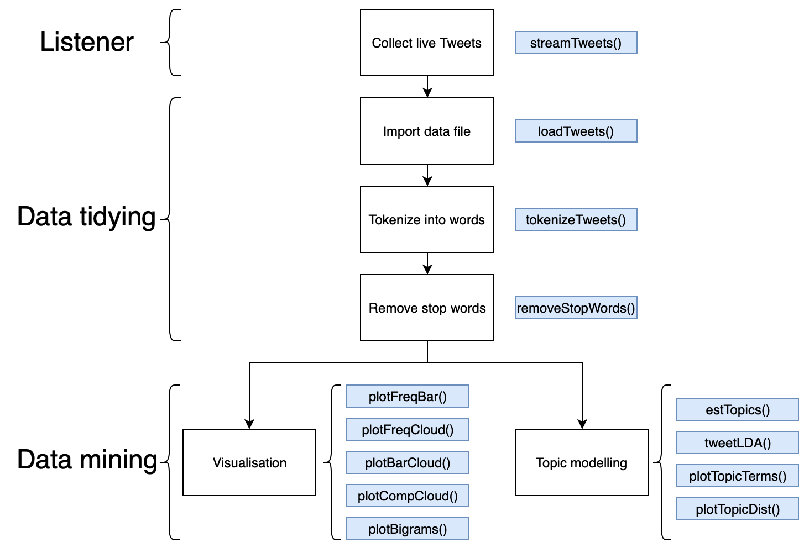

```{r setup, include = FALSE,results='hide'}
knitr::opts_chunk$set(
  collapse = TRUE,
  comment = "#>"
)
```

Short paragraph introducing the package and what it is used for. (will be written when i think of something good)

{width=600px}

## 1 Setting up

Short introduction about collecting tweets, it is possible to do it in the past but this package focuses on collecting live data and analysing it, for more info regarding streaming past tweets see: `?search_tweets()`


mention how it is necessary to set up an account following the twitter authorization steps in the provided link. [`https://rtweet.info`](https://rtweet.info) , ensure that the credentials are set up to make sure the streaming and searching functions work correctly.

Provide examples of `streamTweets()` and its various inputs, provide an example, talk about local directory and making sure its saved, but you can also specifiy file path, for more info see `?streamTweets()`


Start by downloading the `TwitterDMTools` package from Github, for this to work make sure to have the `devtools` package download
```{r message=FALSE,results='hide',cache=TRUE}
#load in devtools package
#library(devtools)

#install TwitterDMTools package from Github repository
#install_github("jakubk28/TwitterDMTools")

#load in TwitterDMTools package
library(TwitterDMTools)
```
Alternatively, the `TwitterDMTools` package can be installed from a local folder by copying the entire package into the R package folder directory.

## 2 Listener  

To begin collecting Twitter data, use the `streamTweets()` function by inputting desired words or phrases to be listened for, and the desired amount of time to do this for. Highly discuessed terms such as `Trump` will result in thousands of Tweets collected within a matter of a minute, whilst more niche topics such as `plastic pollution` will take significantly longer to give results. 

The `streamTweets()` function can also search for multiple terms simultaneously by inputting `"trump,wall"` INSTEAD TALK ABOUT `AND` AND `OR`, this input will return any tweets that mention the words "trump" or "wall" or both. This approach can result in tweets including the word "wall" to be caught in the stream that are unrelated to our analysis.

The final input for the function is the `filename`, this is what the data file will be saved as in the desired location.

```{r message=FALSE,eval=FALSE}
#search for tweets mentioning "trump" for 60 seconds
streamTweets("plastic pollution",60,"conservationTweets.json")
```

## 3 Data tidying

Once a json data file containing all of the tweets has been obtained, we are ready to import the file and start tidying the data in preparation for mining. The function `loadTweets()` can be used to do just that.

```{r message=FALSE,eval=FALSE}
#load in json data file and save as a data frame object
tweetsDF <- loadTweets("conservationTweets.json")
```
For reproducability, the data collection has been contucted before hand, searching for "palm oil" and "plastic pollution" terms within tweets, the final data frame object is included with the package. 

```{r message=FALSE,cache=TRUE}
#load in included tweet data
tweetsDF <- ConservationTweets
```

Whilst dataframes are very good for data mining purposes, the format of the actual data frame returned by the twitter API is not very useful for data mining. Although it is important to mention that the raw data frame just created should be kept for later use, as it will become handy later on to see full, unfiltered tweets.

The first step in tidying the data is to tokenize the text. Tokenization is the process of splitting up a string of text into individual,pairs, or n sets of words. This can easily be achieved using the `tokenizeTweets()` function. The function accepts a dataframe object as an input, specifically the output from the `loadTweets()` function. Whilst the `tokenizeTweets()` function does support tokenizations of $n>0$, any $n>2$ is not recommended for effective twitter data mining as the length of tweets is extremely small resulting in high tokenizations returning whole tweets, contradicting our desired approach of splitting texts up into tokens that have individual meanings.

```{r cache=TRUE}
#tokenize tweets into singular words
tweetsDFtoken1<-tokenizeTweets(tweetsDF,1)

#view the top entries in the tokenized data frame
head(tweetsDFtoken1)
```

Similar results can be obtained by using a tokenization value of 2 or 3.

```{r cache=TRUE}
#pairs of words
#tokenize tweets into pairs of words
tweetsDFtoken2<-tokenizeTweets(tweetsDF,2)

#view the top entries in the pair tokenized data frame
head(tweetsDFtoken2)

#triples of words
#tokenize tweets into pairs of words
tweetsDFtoken3<-tokenizeTweets(tweetsDF,3)

#view the top entries in the triples tokenized data frame
head(tweetsDFtoken3)
```

The data has been parsed, containing only the most important parts of the tweets: the words tweeted. Whilst it would be possible to perform analysis on this data, the results would not show much, lets check this theory using the `tokenFreq` function. The function takes a tokenized data frame as an input and returns the most frequently occuring word or pair/triple of words depending on the tokenization amount.

```{r cache=TRUE}
#display most frequent words
head(tokenFreq(tweetsDFtoken1))
```

It is evident that these highly occuring words have no real meaning and are useless for the purposes of analysis. These words are called stop words. Removing stop words will create unreadable tweets, which is why it is important to keep the original raw tweet file for later cross referencing of certain words. 

Stop words can easily be removed using the `removeStopWords()` function. The function takes an input of a tokenized data frame (the output of `tokenizeTweets()`).

```{r cache=TRUE}
#remove stop words from the dataframe
Token1<-removeStopWords(tweetsDFtoken1)

#most frequent words after removal of basic stop words
head(tokenFreq(Token1))
```

Whilst the default stop words dictionary has removed the majority of unnecessary words for analysis, some still remain. We will start by understanding the context of the word "amp" and assess whether it should remain in the data set, to do this the `tweetContext()` function can be used. The function takes an input of the desired word to be contextualised and the original raw data frame.

```{r cache=TRUE}
#find the context of the word "amp"
SpecificWordContext<-tweetContext(tweetsDF,"chester")
SpecificWordContext
```
From the results, it is possible to gather that the word in question is infact a technical term that appears on tweets when users share and quote other resources; as a result, it can now be excluded from the analysis be running the `removeStopWords()` function again and adding additional terms to be removed. The term "trump" has also been removed as it was the search ter, thus it is evident it it will be highly occuring whilst providing no further insight into the analysis.

```{r cache=TRUE}
#remove stop words from the dataframe
Token1<-removeStopWords(tweetsDFtoken1,c("palm","oil","palmoil"))

#most frequent words after removal of basic stop words
head(tokenFreq(Token1))
```

This process can be repeated numerous times, adding additional terms each time until a data set that is suitable is reached. 

## 4 Data mining
The data mining process can be split up into 2 activities:
  -Visualisation (Frequency plots, word clouds, and sentiment analysis)
  -Topic modelling

## 4.1 Visualisation
The most basic visual plot can be achieved using the `plotFreqBar()` function, the function takes an input of a tokenized data frame, preferablly one that has been tidied but as mentioned previously it does not matter. The function also has an additional input of how many of the top words to display (`default = 10`).

```{r warning=FALSE,fig.align="center",fig.width=5,fig.height=4,cache=TRUE,fig.cap="4.1.1"}
#plot frequency bar chart of most frequently occuring words
plotFreqBar(Token1,5)
```

```{r,echo=FALSE}
Token2<-removeStopWords(tweetsDFtoken2,c("palm","oil","palmoil"))
```

```{r message=FALSE,warning=FALSE,fig.align="center",fig.width=5,fig.height=4,cache=TRUE,fig.cap="4.1.2"}
#plot frequency bar chart of most frequently occuring pairs of words
plotFreqBar(Token2,5)
```

Another way to visualising word frequency is word cloud plots. Word clouds display words with varying sizes depending on frequency, this can easily be achieved within the package by using the `plotFreqCloud()` function. The function takes the same data input as the `plotFreqBar()` function (a tokenized dataframe), however, word cloud plots can only be generated for tokenizations of 1, so pair or triples of words will not work. One additional parameter associated with the `plotFreqCloud()` function is the `minWordFreq` variable, this indicates the minimum frequency a word must have for it to be plotted on the cloud plot.

```{r message=FALSE,warning=FALSE,fig.align="center",fig.width=4,fig.height=4,cache=TRUE,fig.cap="4.1.3"}
#plot frequency cloud of at most 30 words, occuring at least 2 times
plotFreqCloud(Token1,maxWords = 30,minWordFreq = 2)
```

The final basic visualisation function is `plotBigrams()`;the function produces a term network displaying how the most frequent terms occur within the text. The function takes in an input of a data frame tokenized specifically into pairs of words (`n=2`), as well as an optional parameter `minWordFreq` specifying the minimum frequency of a word to appear on the network plot.

```{r message=FALSE,warning=FALSE,fig.align="center",fig.width=6,fig.height=6,cache=TRUE,fig.cap="4.1.4"}
#plot term network using bigrams (tokenization of 2)
plotBigrams(Token2,minWordFreq = 50)
```

## 4.2 Sentiment analysis
Basic visualisation functions like `plotFreqBar()` and `plotFreqCloud()` allow us to see the most frequently occuring meaningful words, this however does not tell the full story of the context behind the tweets. As a result, we can use sentiment analysis tools to attempt to extract further knowledge from the corpus.

Sentiment anaylsis is the process of extracting emotional context from a corpus, in this case, the emotions felt by writers within their tweets. The concept behind sentiment analysis is that most words have either a positive or negative conotation; by comparing the frequencies of these words, either locally within a tweet or globally within the corpus, it is possible to analyse the overall sentiment felt by the auther or authers respecitvely. 

The two sentiment analysis `plotCompBar()` and `plotCompCloud()` operate by comparing a sentiment lexicon (a list of words with a corresponding binary term determining whether the word is positive or negative), this then gives each word in our data set a positive or negative value which can then be plotted. In the area of natural language processing, there numerous sentiment lexicons (bing, AFINN, nrc) each with different purposes; the functions in the package use the 'bing' lexicon, which uses a binary approach of either positive or negative. Conversely, the 'AFINN' lexicon expands on the 'bing' lexicon by having a scale of how positive and negative the word is from 1-5; for instance, the world 'like' has a value of 2 whilst the word 'love' has a value of 3, displaying a stronger positivity. (aside for JJ:i will put this in the report instead as its unrelated to the guide)

Similarly to the `PlotFreqBar()` function, the `plotCompBar()` function takes in a single word tokenized data frame, with optional parameters including minimum frequency for a word to be displayed, and maximum number of words displayed, essentially giving the plot upper and lower bounds.

```{r message=FALSE,fig.align="center",fig.width=5,fig.height=4,cache=TRUE,fig.cap="4.2.1"}
#comparison bar chart of most used positive and negative words
plotCompBar(Token1,maxWords = 5,minWordFreq = 2)
```

The function produces two frequency plots, displaying the top `n` highest frequency positive and negative words within the data set. As before, it is also to plot this result in a word cloud format using the `plotCompCloud()` function. As with the previous cloud plot function, the function takes an input of a single word tokenized data frame, with optional parameters dictating minimum word frequency and maximum number of words to appear.

```{r message=FALSE,warning=FALSE,fig.align="center",fig.width=4,fig.height=4,cache=TRUE,fig.cap="4.2.2"}
#comparison bar chart of most used positive and negative words
plotCompCloud(Token1,maxWords = 20,minWordFreq = 5)
```

It is important to understand that format of the cloud plot means that the size of each word represents the frequency of that word. However, in this case the size is respective to the proportion of that word within the positive or negative classes, not the entire corpus, which is why certain positive words might appear larger in the plot and mislead the readed; consequently, it is important to use both functions `plotCompBar()` and `plotCompCloud()` to gauge the sentiment of the corpus.

## 4.3 Topic modelling
In text mining it is often interesting and worthwhile to investigate and identify distinct topics being discussed within the text corpus. Topic modelling achieves this by performing unsupervised clustering algorithms on a corpus that consists of numerous documents in order to identify natural groups of words that fit together to form topics. 

Whilst there are numerous algorithms within the topic modelling scene, this package will focus on using the Latent Dirichlet allocation (LDA) method, one of the most popular topic modelling algorithms [ref]. The method treats each document within the data set as a mixture of topics, and each topic as a mixture of words. This approach is particularly useful when analysing organic texts, such as tweets; authors often mention a number of topics within one tweet rather than just one, meaning that documents overlap in terms of topics within them.

INCLUDE A SUBTLE MATHS EXPLAINATION OF HOW IT WORKS + INCLUDE EQUATION

In order to perform the LDA algorithm, number of clustering groups must be specified. Whilst this would be an easy feat in an example such as a newspaper (as it would contain distinct countable topics: sport, finance, politics) the number in our case must be estimated due to the unknown nature of the topics contained within the tweets. There are a number of ways to estimate number of topics for a text [ref], this package however will use a neat compliation package `ldatuning` [ref] which takes various performance metrics and trials them on a range of topic numbers specified, returning a intuative result for a possible range of suitable topics. 

To begin topic estimation, simply pass a tokenized tweet data frame into the `estTopics()` function and specify a range of topic numbers to trial. In this case we will trial topics ranging from 2 to 16 in intervals of 1.

```{r message=FALSE,results=FALSE,cache=TRUE,fig.align="center",fig.width=6,fig.height=6,fig.cap="4.3.1"}
#estimate number of topics in topic model
estimatedTopicNumber <- estTopics(Token1,2,16,1)
```

When optimizing hyperparameters for classification and clustering algorithms, it is often the case that there is no optimal value [ref]. Instead, like in this case, a range of possible values are obtained that should be tried in practise. By assessing figure 4.3.1 possible topic numbers could include: 4, 5, and 9. 

```{r message=FALSE,cache=TRUE}
#create LDA model with 9 topics
ExampleLDA<-tweetLDA(Token1,9)
```

Once a LDA model has been fitted, it is a good idea to check what topics have been found from the corpus of tweets and whether they make contextual sence in terms of our keywords. The `plotTopicTerms()` function can be used to plot the top terms associated with each topic, along with the term's respective $\beta$ value.

```{r message=FALSE,warning=FALSE,fig.align="center",fig.width=7,fig.height=6,cache=TRUE,fig.cap="4.3.2"}
#plot words for 9 topics of model
plotTopicTerms(ExampleLDA)
```

Most of the topics make sense and seem appropraite to our search for tweets including "palm oil" and "plastic pollution", one clear result is that not a lot of tweets associated with plastic pollution were detected, as indicated by the lack of the terms within the topics. A lot of the topics in figure 4.3.2 make sense, topic 1 is focused around the news of the city of Chester being the first to be palm oil sustainable [ref], topic 6 being about products within the uk which still involve palm oil such as nutella [ref], and topic 4 focusing around Gregg's new vegan sausage roll and introduction of new vegan alternatives within food brands [ref]. Some topics such as 9 are not as clear, to get a better understanding of some of these terms we can refer to figure 4.1.4, the term network suggests that the news letter is an analytical newsletter and there are tweets raising awareness for it, indicated by the "visit" term. This is also enforced by the "infopalmoilanalyticscom" term suggesting a link to a analytical website regarding palm oil. 

The topics seem sensible, one final measure to gauge the accuracy of the model is to plot the $\gamma$ distribution of the documents within the topics using the `plotTopicDist()` function.

```{r message=FALSE,warning=FALSE,fig.align="center",fig.width=7,fig.height=6,cache=TRUE,fig.cap="4.3.3"}
#plot distribution of documents within topics
plotTopicDist(ExampleLDA)
```

Each plot within figure 4.3.3 shows a distrubtion of the $\gamma$ values for each of the documents in the corpus respective to that topic, where $\gamma$ is the estimated proportion of words from that document that are generated specifically from that topic. High spikes close to close to $\gamma=0$ in the majority of the topics indicates that there is a high proportion of words in those documents not being generated from that topic; this is expected as most documents will not belong in every topic. Higher $\gamma$ value spikes indicate that there is a high proportion of words within a document that are generated specifically from that topic. For example, topic 9 has a group of documents with $\gamma$ values relatively higher than the rest of the documents, indicating that around 40% of the words within those documents are generated exclusively from topic 9. Taking this idea back to the terms of topic 9, many were raising awareness and advertising a newsletter about palm oil, in which case the majority of the tweet would be focused around advertising the newsletter.

#dev svg
#ops knit get oabdic katex


footnotes^[Ain case i need format for footnote.]


